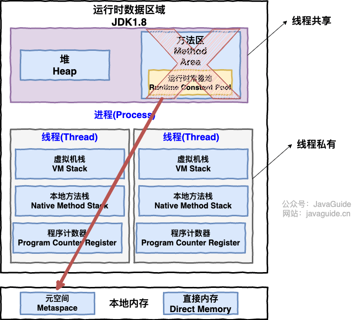

# Java

------

## 基础特性
### 基本类型，包装类型缓存，自动装箱，拆箱，Object,String

------

### 集合，stream

------

### 多态，继承，接口，抽象类，代理
### 异常
### 泛型
### 反射
### 注解
### IO模型

## 并发编程

### 进程，线程，并发，并行，同步，异步

### 并发编程三个重要特性
  - 原子性
  - 可见性
  - 有序性

------

### 线程生命周期

### 线程池
- 线程池：
  - 作用 
  - 创建
  - 常见参数
  - 处理流程
  - 
  - 饱和策略
  - 阻塞队列
  - 配置线程池大小的策略
    - CPU密集型--N+1
    - IO密集型--2N
- Executor
- Executor 框架不仅包括了线程池的管理，还提供了线程工厂、队列以及拒绝策略等，Executor 框架让并发编程变得更加简单。
  - 任务: Callable,Runnable
    - Runnable 接口不会返回结果或抛出检查异常，execute()提交任务
    - Callable Runnable 强化版，可以返回结果或抛出检查异常，submit()提交任务
  - 执行: Executor,ExecutorService,ThreadPoolExecutor,ScheduledThreadPoolExecutor
  - 
  - 异步结果: Future，FutureTask,CompletableFuture
    - Future.get()
- 几种常见的内置线程池
  - FixedThreadPool 被称为可重用固定线程数的线程池
  - SingleThreadExecutor 是只有一个线程的线程池。
  - CachedThreadPool 是一个会根据需要创建新线程的线程池。
  - ScheduledThreadPool 用来在给定的延迟后运行任务或者定期执行任务。

### 常见并发容器
- ConcurrentHashMap : 线程安全的 HashMap
- CopyOnWriteArrayList : 线程安全的 List，在读多写少的场合性能非常好，远远好于 Vector。
- ConcurrentLinkedQueue : 高效的并发队列，使用链表实现。可以看做一个线程安全的 LinkedList，这是一个非阻塞队列。
- BlockingQueue : 这是一个接口，JDK 内部通过链表、数组等方式实现了这个接口。表示阻塞队列，非常适合用于作为数据共享的通道。
- ConcurrentSkipListMap : 跳表的实现。这是一个 Map，使用跳表的数据结构进行快速查找。
------

### 锁
- CAS,AQS,ReentrantLock,Semaphore,CountDownLatch
  - CAS: CompareAndSwap(CompareAndSet)
  - AQS: AbstractQueueSynchronizer-->CLH队列锁
  - Semaphore: 指定数量线程共享资源
  - CountDownLatch: 指定数量线程阻塞在某处，线程间等待
  - CyclicBarrier: CountDownLatch强化版
- synchronized,volatile
- ThreadLocal
- 乐观锁，悲观锁,共享锁，独占锁，读锁，写锁
- 线程死锁描述的是这样一种情况：多个线程同时被阻塞，它们中的一个或者全部都在等待某个资源被释放。由于线程被无限期地阻塞，因此程序不可能正常终止。
- 上面的例子符合产生死锁的四个必要条件：
  - 互斥条件：该资源任意一个时刻只由一个线程占用。
  - 请求与保持条件：一个线程因请求资源而阻塞时，对已获得的资源保持不放。
  - 不剥夺条件:线程已获得的资源在未使用完之前不能被其他线程强行剥夺，只有自己使用完毕后才释放资源。
  - 循环等待条件:若干线程之间形成一种头尾相接的循环等待资源关系
- 避免死锁
  - 破坏请求与保持条件 ：一次性申请所有的资源。
  - 破坏不剥夺条件 ：占用部分资源的线程进一步申请其他资源时，如果申请不到，可以主动释放它占有的资源。
  - 破坏循环等待条件 ：靠按序申请资源来预防。按某一顺序申请资源，释放资源则反序释放。破坏循环等待条件。

------

### Java 内存模型（JMM）
- 缓存模型
  - cpu l1,l2,l3三级缓存<-->内存
  - 
  - 线程 --> JVM本地内存<-->主内存
  - 
  - Java内存区域（JVM运行时存储数据分区）和JMM(抽象线程和主内存关系，规定了代码->cpu指令的并发开发规范）
- 指令重排序
  - Java 源代码会经历 编译器优化重排 —> 指令并行重排 —> 内存系统重排 的过程，最终才变成操作系统可执行的指令序列。
  - 指令重排序可以保证串行语义一致，但是没有义务保证多线程间的语义也一致
  - 对于编译器，通过禁止特定类型的编译器重排序的方式来禁止重排序。对于处理器，通过插入内存屏障（Memory Barrier，或有时叫做内存栅栏，Memory Fence）的方式来禁止特定类型的处理器重排序。
  - happens-before 原则
    -  happens-before 原则的诞生是为了程序员和编译器、处理器之间的平衡。程序员追求的是易于理解和编程的强内存模型，遵守既定规则编码即可。编译器和处理器追求的是较少约束的弱内存模型，让它们尽己所能地去优化性能，让性能最大化。
    -  happens-before 原则的设计思想其实非常简单：为了对编译器和处理器的约束尽可能少，只要不改变程序的执行结果（单线程程序和正确执行的多线程程序），编译器和处理器怎么进行重排序优化都行。
    -  对于会改变程序执行结果的重排序，JMM 要求编译器和处理器必须禁止这种重排序。
    - 

------

# JVM
## JVM运行时数据区域

- 堆
  - 分代
- 虚拟机栈
- 方法区
- 直接内存

### 类文件结构
### 类加载过程，类加载器，双亲委派
### JVM中对象的创建
1. 类加载检查
2. 分配内存
3. 初始化零值
4. 设置对象头
5. 执行init方法

### 对象的内存结构
- 对象头
- 实例数据
- 对齐填充
### 对象的访问定位
- 句柄
- 直接指针
### 字符串常量池
### OOM

## GC垃圾回收
### 堆结构
### 分配和回收原则
### 死亡对象判断方法
### 垃圾收集算法
### 垃圾收集器

## 重要常用参数
### 堆内存
### 垃圾收集
### 处理OOM

## JDK 监控和故障处理工具
这些命令在 JDK 安装目录下的 bin 目录下：jps (JVM Process Status）: 类似 UNIX 的 ps 命令。用于查看所有 Java 进程的启动类、传入参数和 Java 虚拟机参数等信息；jstat（JVM Statistics Monitoring Tool）: 用于收集 HotSpot 虚拟机各方面的运行数据;jinfo (Configuration Info for Java) : Configuration Info for Java,显示虚拟机配置信息;jmap (Memory Map for Java) : 生成堆转储快照;jhat (JVM Heap Dump Browser) : 用于分析 heapdump 文件，它会建立一个 HTTP/HTML 服务器，让用户可以在浏览器上查看分析结果;jstack (Stack Trace for Java) : 生成虚拟机当前时刻的线程快照，线程快照就是当前虚拟机内每一条线程正在执行的方法堆栈的集合
------

# Spring
### Spring 核心原理
### Spring Bean 生命周期
### Spring 依赖注入
### Spring 循环依赖
### Spring Aop原理
### Spring 事务原理
### Spring 事务失效的原因
### Spring 事务传播性质
### Spring 启动流程
### SpringMVC 核心原理
## SpringBoot
### SpringBoot 启动流程
### SpringBoot 自动配置原理

# SpringCloud

# MySQL
### 三大范式
### 日志
### 框架
### 引擎
### 事务
### 隔离级别
### 锁
### 索引
### 分库分表
### SQL优化

# Redis
### 特性
### 数据结构
### 持久化
### 用途
### 过期策略
### 内存淘汰机制
### 缓存穿透、击穿、雪崩
### 缓存一致性
### 主从复制
### 集群，哨兵

# 系统设计
### 认证授权
### JWT
### SSO单点登录
### 权限管理
### 数据脱敏
### 敏感词过滤
### 计算在线峰值
### 定时任务
### 实时消息

# 设计模式

## 创建型模式
### 单例模式

### 工厂模式
### 建造者模式

## 结构型模式

### 代理模式

## 行为型模式

## MVX模式及变种

# 网络
### TCP 三次握手四次挥手
### HTTP，HTTPS
