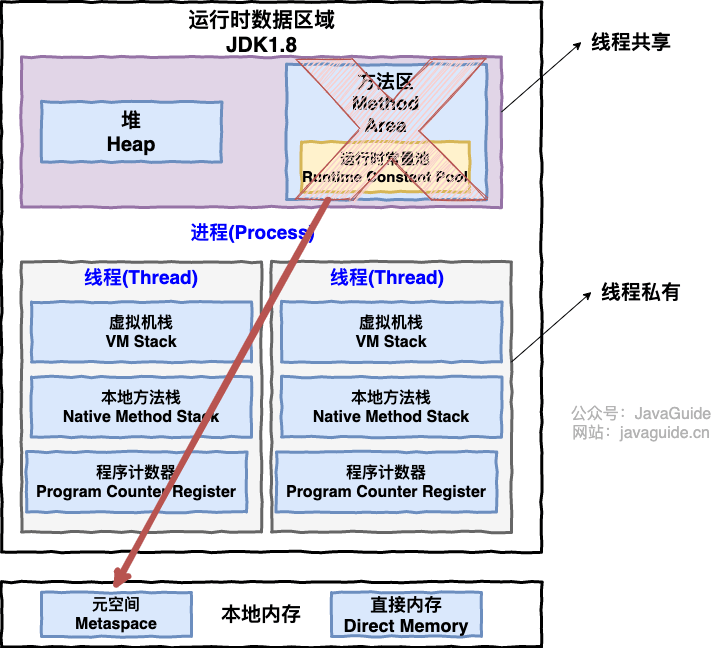

# Java

------

## 基础特性
### 基本类型，包装类型缓存，自动装箱，拆箱，Object,String

------

### 集合，stream

------

### 多态，继承，接口，抽象类，代理
### 异常
### 泛型
### 反射
### 注解
### IO模型

## 并发编程

### 进程，线程，并发，并行，同步，异步

------

### 线程生命周期

------

### 锁
- 乐观锁，悲观锁,CAS,synchronized,volatile,AQS
- 线程死锁描述的是这样一种情况：多个线程同时被阻塞，它们中的一个或者全部都在等待某个资源被释放。由于线程被无限期地阻塞，因此程序不可能正常终止。
- 上面的例子符合产生死锁的四个必要条件：
  - 互斥条件：该资源任意一个时刻只由一个线程占用。
  - 请求与保持条件：一个线程因请求资源而阻塞时，对已获得的资源保持不放。
  - 不剥夺条件:线程已获得的资源在未使用完之前不能被其他线程强行剥夺，只有自己使用完毕后才释放资源。
  - 循环等待条件:若干线程之间形成一种头尾相接的循环等待资源关系
- 避免死锁
  - 破坏请求与保持条件 ：一次性申请所有的资源。
  - 破坏不剥夺条件 ：占用部分资源的线程进一步申请其他资源时，如果申请不到，可以主动释放它占有的资源。
  - 破坏循环等待条件 ：靠按序申请资源来预防。按某一顺序申请资源，释放资源则反序释放。破坏循环等待条件。

------

### Java 内存模型（JMM）

# JVM
### 内存结构

### 类加载，双亲委派
### 

# Spring
### Spring 核心原理
### Spring Bean 生命周期
### Spring 依赖注入
### Spring 循环依赖
### Spring Aop原理
### Spring 事务原理
### Spring 事务失效的原因
### Spring 事务传播性质
### Spring 启动流程
### SpringMVC 核心原理
## SpringBoot
### SpringBoot 启动流程
### SpringBoot 自动配置原理

# SpringCloud

# MySQL
### 三大范式
### 日志
### 框架
### 引擎
### 事务
### 隔离级别
### 锁
### 索引
### 分库分表
### SQL优化

# Redis
### 特性
### 数据结构
### 持久化
### 用途
### 过期策略
### 内存淘汰机制
### 缓存穿透、击穿、雪崩
### 缓存一致性
### 主从复制
### 集群，哨兵

# 系统设计
### 认证授权
### JWT
### SSO单点登录
### 权限管理
### 数据脱敏
### 敏感词过滤
### 计算在线峰值
### 定时任务
### 实时消息

# 设计模式

## 创建型模式
### 单例模式

### 工厂模式
### 建造者模式

## 结构型模式

### 代理模式

## 行为型模式

## MVX模式及变种

# 网络
### TCP 三次握手四次挥手
### HTTP，HTTPS
